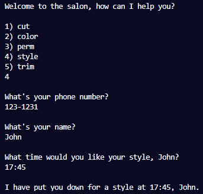
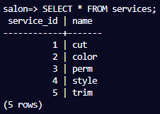
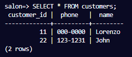
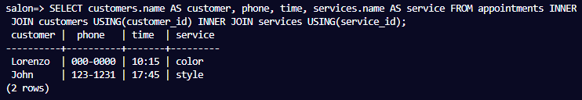

# Salon Appointment Scheduler

- This shell script emulates an appointment scheduler and saves information to a PostgreSQL database.

Technologies used: PostgreSQL, Shell Script

# Live Version Output

# Requirements

